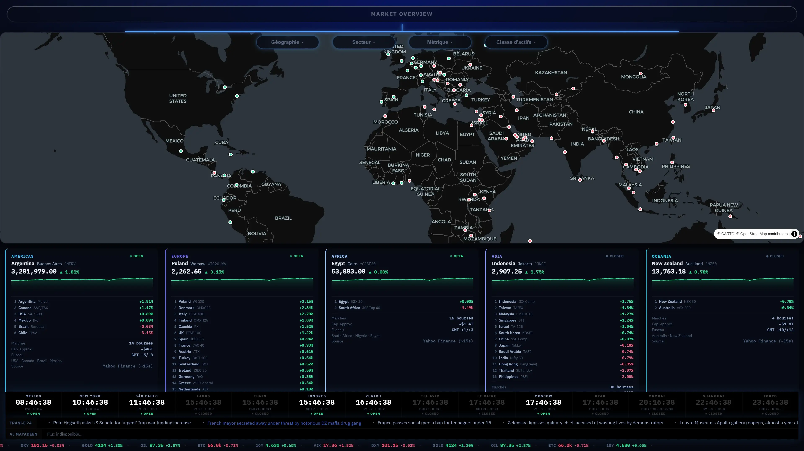
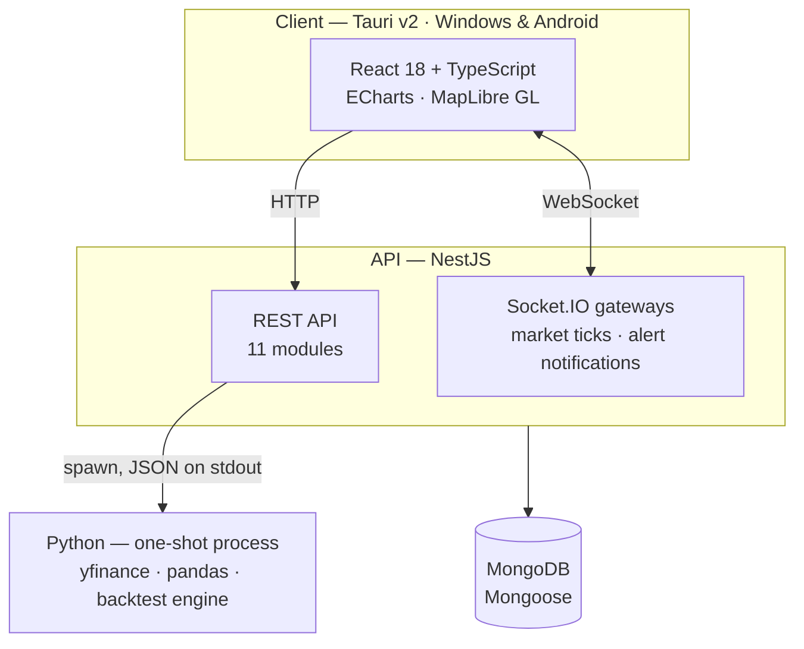

# 7vndvlv

**The goal: one workspace for the entire investing loop.**

From global markets and live news channels to a broker-connected portfolio, price alerts and a bench to backtest and compare systematic strategies.

In development · **v0.1.3** · Windows · Android · Source private

[**Features**](#features) · [**Demo**](#try-it) · [**Architecture**](#architecture--c4-container-view) · [**Decisions**](#engineering-decisions) · [**Roadmap**](#status--limits)

*Five screens of v0.1.3 running in its offline demonstration mode.*

---

## Context

A personal engineering project developed alongside a master's in finance, with the
objective of moving toward quantitative finance.

The scope was threefold: implement and evaluate systematic trading strategies,
maintain a consolidated view of global markets and carry a product through to a
packaged, auto-updating build.

The desktop form factor is deliberate. A hosted financial application carries
regulatory obligations that a locally executed one does not; portfolio data, market
data and strategy code remain on the machine that runs them.

Approximately 40 commits, June–July 2026.

---

## Features

**Global market overview** — an interactive world map of exchanges with live
indices grouped by region, continental panels and world clocks.

**Live news streams** — up to six broadcast channels side by side (France 24,
Al Jazeera, CNA, Bloomberg, Euronews, NHK World, Sky News, DW, WION, TRT World),
embedded as rolling live streams so they survive channel restarts.

**News feed** — headlines from four wire sources scrolling under the market
panels.

**Portfolio tracking** — holdings and allocation by asset class, risk metrics
(beta, Sharpe, alpha), daily and year-to-date P&L, plus cash movements with a
capital-gains tax estimate.

**Charting** — base-100 performance with RSI, MACD and volume overlays on any
holding or index.

**Backtesting** — a Python engine running moving-average crossover strategies over
up to 10 years of history. Given a ticker, fast and slow windows and a period, the
engine computes 18 statistics (Sharpe, Sortino, max drawdown, win rate, expectancy,
fees), an equity curve against benchmark and a full trade log. The app currently
surfaces the summary return — the full report view is in progress.

**Price alerts** — per-instrument thresholds delivered over a WebSocket gateway.

---

## Try it

Builds for **Windows** and **Android** are published under [Releases](../../releases/latest).

**It runs without a backend.** On launch the app probes for its API; if nothing
answers, it falls back to a built-in demonstration mode: market data frozen from
the real service, a fictional portfolio, and a real backtest result computed by the
Python engine. The map, the charts and the backtest are all reachable; positions
can be added and the allocation recomputes accordingly. Nothing is persisted, and a
banner states as much.

**Windows** — a standard PC (Intel / AMD) takes the `x64` installer, an ARM PC
(Snapdragon, Surface Pro X) the `arm64` one. Neither is code-signed, so SmartScreen
shows a *"Windows protected your PC"* screen on first run — click **More info** →
**Run anyway**.

**Android** — install the `.apk` directly. Distributed outside the Play Store, so
Android asks you to allow the source once, then install.

---

## Architecture — C4 container view

The API exposes eleven modules — `health`, `auth`, `market`, `portfolio`,
`cashflow`, `price-alerts`, `strategies`, `algo`, `news`, `ai`, `changelog` — plus
two Socket.IO gateways, one for market ticks and one for alert notifications.

**The Python bridge.** NestJS keeps no long-running Python process. Each request
that needs market data or a backtest spawns a script, reads JSON off its stdout and
parses it; the process then exits. No queue, no broker, no shared state. The cost
is roughly 200–400 ms of interpreter startup per request; the benefit is that a
script that hangs or crashes can never poison the API.

---

## Engineering decisions

| Decision | Why | Alternative rejected | Trade-off accepted |
|---|---|---|---|
| **Tauri v2** for the desktop shell | Installers under 4 MB and a minisign-signed update manifest, against roughly 150 MB for a Chromium-based shell | Electron | A Rust toolchain in the build chain, and one build per target architecture |
| **One-shot Python processes** | Each request spawns a script and reads JSON off its stdout; pandas and yfinance never share state with the Node process | A long-lived Python service | 200–400 ms of interpreter startup on every request |
| **Session in a cookie *and* a Bearer token** | The Tauri webview has no usable cookie jar — the cookie is dropped silently, with no error to catch | Cookie only | Two session paths to keep in sync, and a token reachable from JavaScript |
| **Hash routing and self-hosted fonts** | The bundled app must render with no network at all | Browser routing + Google Fonts | A `#` in every URL, and font files carried in the bundle |
| **`native-tls` over `rustls`** | `rustls` pulls in `ring`, which needs a clang toolchain on Windows; SChannel already ships with the OS | `rustls` | TLS behaviour follows the host OS store instead of being identical everywhere |
| **Updater excluded from the Android build** | `native-tls` uses the Windows cert store but drags in OpenSSL, which won't cross-compile for Android | A single cross-platform updater | Android checks GitHub Releases in-app instead of updating silently |
| **Offline mode by intercepting one fetch chokepoint** | Every HTTP call already funnelled through a single function, so offline support cost one modified function instead of 26 mocked components | Per-component mocks | Frozen fixtures age with every market day, and WebSocket traffic bypasses the chokepoint |

---

## Problems solved

### MongoDB Atlas unreachable on a local network

**Symptom** — every connection failed with `querySrv ECONNREFUSED`.
**Cause** — the network handed out a DNS server that Node's c-ares resolver could
not query directly, so `mongodb+srv` never resolved.
**Fix** — an optional `DNS_SERVERS` variable applied through `dns.setServers()`
before bootstrap. Left unset in hosted environments, which keep normal DNS.

### Memory exhaustion on a 512 MB host

**Symptom** — the container kept hitting its memory ceiling and restarting.
**Cause** — the background market poller spawned a fresh pandas process every
15 seconds; once Yahoo rate-limited the cloud IP, polls outlasted their interval
and the processes stacked.
**Fix** — a re-entrancy guard so only one poll runs at a time, a two-minute
interval, and a `DISABLE_MARKET_POLLING` kill switch.

### A shipped app that displayed nothing

**Symptom** — installing the released build led to a login form and no further.
**Cause** — the backend URL is frozen into the bundle at build time and pointed at
`localhost:3000`, the *visitor's* machine, where nothing listens. Sixteen of the
eighteen routes sit behind that login gate.
**Fix** — a startup probe against the API; when nothing answers, a demonstration
layer serves 32 routes from fixtures captured off the real service, opens the gate
with a demo session, and shows a banner stating that the data is frozen.

---

## Tech stack

| Layer | Technology |
|---|---|
| Shell | Tauri v2 (Rust) — Windows (NSIS/MSI) and Android (APK); minisign-signed desktop updater |
| Frontend | React 18 + TypeScript, Vite, ECharts, MapLibre GL |
| Real-time | Socket.IO — two gateways |
| Backend | NestJS — 11 REST modules |
| Auth | JWT, bcrypt, TOTP multi-factor (otplib, qrcode) |
| Database | MongoDB Atlas, Mongoose schemas |
| Quant / data | Python — yfinance, pandas, moving-average backtest engine |
| Packaging | Dockerfile for the API |

---

## Status & limits

In active development. What follows is what the app does not do yet.

**Known limits**

- **Authorisation is client-side only.** JWT sessions and TOTP multi-factor are
  implemented, but no server-side guard enforces them — the API trusts its caller.
  Acceptable while it listens on localhost; the first thing to fix before any
  deployment.
- **The backend is not hosted.** The client expects an API on localhost, or
  falls back to offline mode.
- **Two pages are scaffolding.** The screener and the strategy repository have
  routes and headers, but no data view yet.
- **The AI assistant and the in-app strategy editor are built but unrouted.**

**Expected features**

- A screener view over the existing API, which already returns the rows
- The full backtest report — the equity curve, drawdown and trade log are computed
  and returned today, but nothing renders them
- Thematic sector watch — the dial is in place, the feeds are not wired
- Server-side authorisation
- Broker integration for live orders — a goal, not started

---

**The source code is private.** This repository hosts the installers, the update
manifest and this write-up.

**Author:** Omar Ben Youssef
