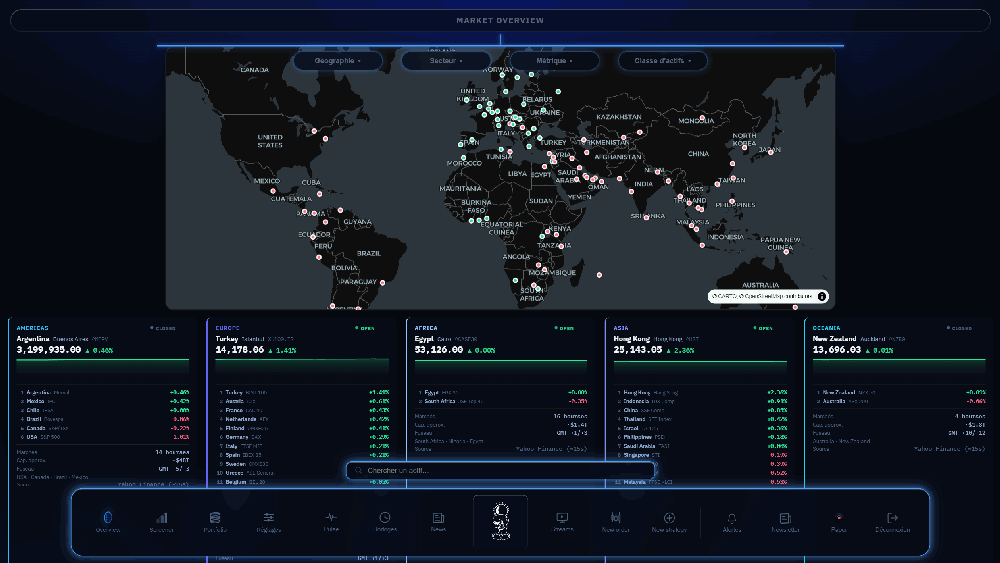
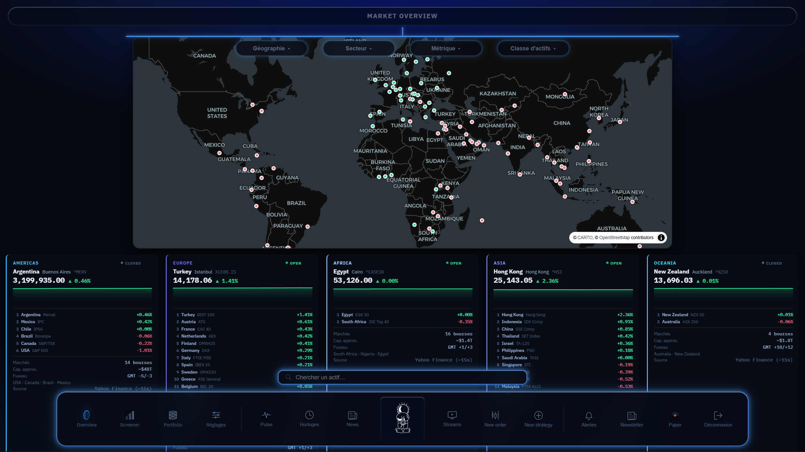
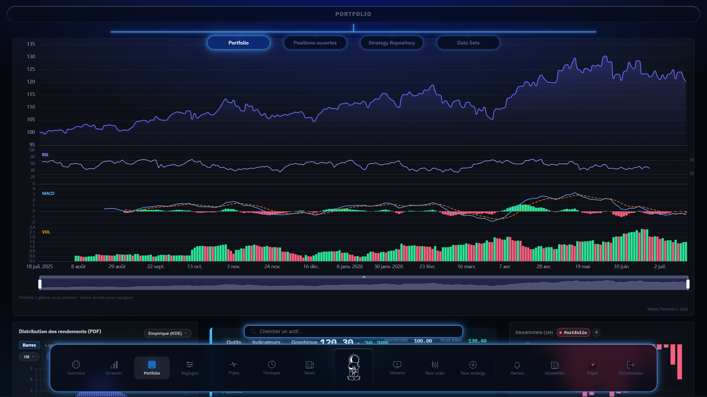
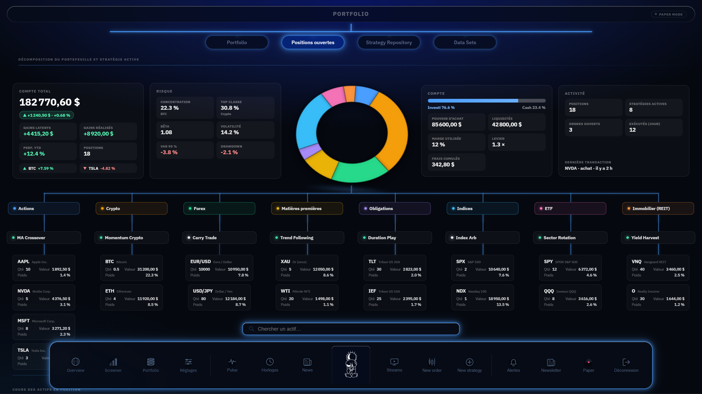

# Market Screener

> A desktop platform to screen global markets, track portfolios and backtest
> trading strategies — live global overview, portfolio analytics and a strategy
> backtesting engine, in a native cross-platform app.

**🚧 Work in progress — in active development (2026 – present).**

## Highlights

- 🌍 **Global market overview** — world map + live indices across every region
- 📊 **Portfolio analytics** — allocation, risk metrics (beta, VaR, drawdown), P&L
- 📈 **Pro charting** — base-100 performance with RSI / MACD / volume overlays
- 🔎 **Screener** — filter instruments across asset classes
- ⏳ **Backtesting engine** — evaluate strategies on historical data

## Gallery

| Market overview | Portfolio chart | Positions & risk |
|---|---|---|
|  |  |  |

## Tech stack

| Layer | Technology |
|---|---|
| Frontend | React 18 + TypeScript (Vite), ECharts, MapLibre GL |
| Backend  | NestJS, REST + Socket.IO real-time gateways |
| Database | MongoDB (Mongoose) |
| Quant / Data | Python (yfinance, pandas), backtesting engine |
| Desktop  | Tauri v2 — signed bundles + auto-updater |

## About

Full-stack financial platform packaged as a native desktop app. **The source code
is private** — this repository hosts the public demo. Screens run in the app's
paper-trading (demo) mode.

> Windows builds live under [Releases](../../releases/latest). The desktop client
> connects to a backend service; the demo above shows it running against a local backend.

**Author:** Omar Ben Youssef
