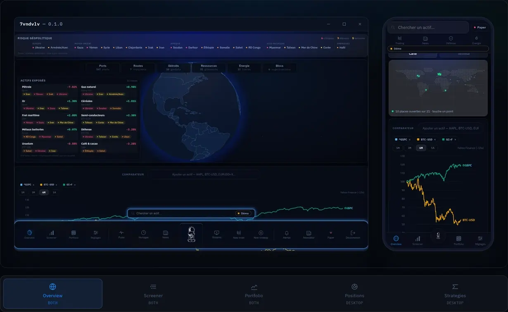
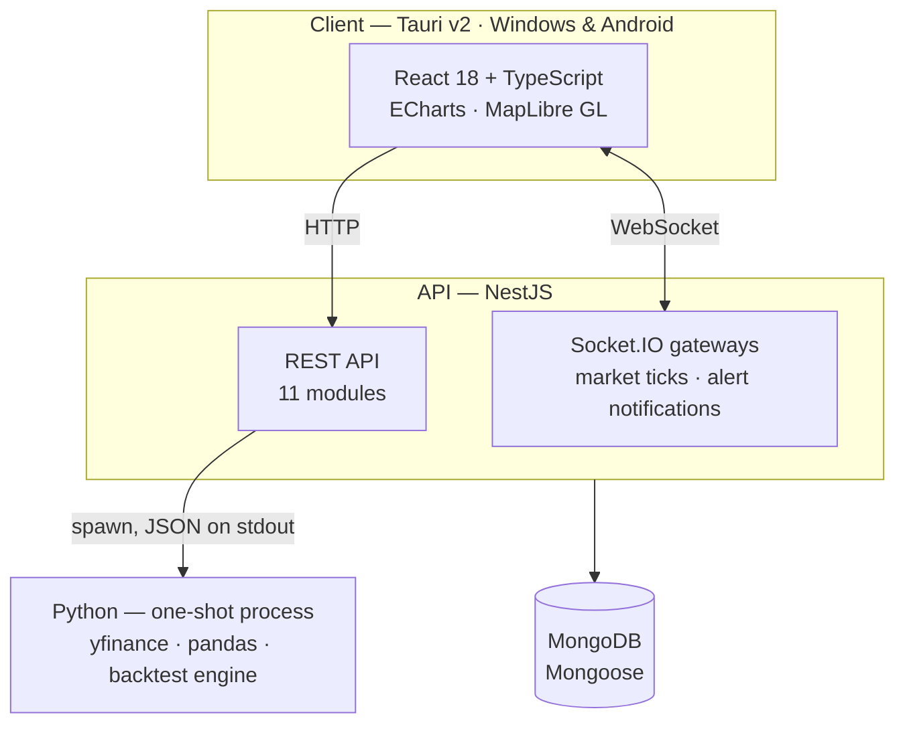

# 7vndvlv

**The goal: one workspace for the entire investing loop.**

From global markets and live news channels to a broker-connected portfolio, price alerts and a bench to backtest and compare systematic strategies.

In development · **v0.1.3** · Windows · Android · Source private

[**Features**](#features) · [**Demo**](#demo) · [**Architecture**](#architecture) · [**Decisions**](#decisions) · [**Roadmap**](#roadmap)

*Five screens of v0.1.3 running in its offline demonstration mode.*

---

Built solo alongside a master's in finance, aiming for quantitative finance — the
whole stack from the React client to the Python quant engine, in roughly 40 commits
over June–July 2026.

---

## Features

Markets in, decisions out:

|  |  |
|---|---|
| **Global market overview** | World map of exchanges, live indices by region, continental panels, clocks |
| **Live news streams** | Up to six broadcast channels side by side, as rolling live streams |
| **News feed** | Headlines from four wire sources under the panels |
| **Portfolio tracking** | Allocation by asset class, risk metrics (beta, Sharpe, alpha), P&L, capital-gains tax estimate |
| **Charting** | Base-100 performance with RSI, MACD and volume overlays |
| **Backtesting** | Python MA-crossover engine — 18 statistics, equity curve, drawdown, full trade log |
| **Price alerts** | Per-instrument thresholds over a WebSocket gateway |

---

## Demo

The quickest way to judge any of it is to run it — and it runs with no backend at all.

On launch the app probes for its API; if nothing answers, it drops into a built-in
demonstration mode: frozen market data, a fictional portfolio, and a real backtest
from the Python engine. Nothing is persisted, and a banner says so.

Builds are published under [Releases](../../releases/latest):

| Platform | File | First run |
|---|---|---|
| **Windows** — Intel / AMD | `x64` installer | SmartScreen → **More info** → **Run anyway** |
| **Windows** — ARM (Snapdragon, Surface Pro X) | `arm64` installer | same |
| **Android** | `.apk` | allow the source once, then install |

---

## Architecture

Four moving parts, at the C4 container level:

```mermaid
flowchart TB
    subgraph client["Client — Tauri v2 · Windows & Android"]
        ui["React 18 + TypeScript<br/>ECharts · MapLibre GL"]
    end

    subgraph api["API — NestJS"]
        rest["REST API<br/>11 modules"]
        ws["Socket.IO gateways<br/>market ticks · alert notifications"]
    end

    db[("MongoDB<br/>Mongoose")]
    py["Python — one-shot process<br/>yfinance · pandas · backtest engine"]

    ui -->|HTTP| rest
    ui <-->|WebSocket| ws
    api --> db
    rest -->|spawn, JSON on stdout| py
```

The API exposes eleven modules — `health`, `auth`, `market`, `portfolio`,
`cashflow`, `price-alerts`, `strategies`, `algo`, `news`, `ai`, `changelog` — plus
two Socket.IO gateways, one for market ticks and one for alert notifications.

**The Python bridge.** NestJS keeps no long-running Python process. Each request
that needs market data or a backtest spawns a script, reads JSON off its stdout and
parses it; the process then exits. No queue, no broker, no shared state. The cost
is roughly 200–400 ms of interpreter startup per request; the benefit is that a
script that hangs or crashes can never poison the API.

**The stack.**

| Layer | Technology |
|---|---|
| Shell | Tauri v2 (Rust) — Windows (NSIS/MSI) and Android (APK); minisign-signed desktop updater |
| Frontend | React 18 + TypeScript, Vite, ECharts, MapLibre GL |
| Real-time | Socket.IO — two gateways |
| Backend | NestJS — 11 REST modules |
| Auth | JWT, bcrypt, TOTP multi-factor (otplib, qrcode) |
| Database | MongoDB Atlas, Mongoose schemas |
| Quant / data | Python — yfinance, pandas, moving-average backtest engine |
| Packaging | Dockerfile for the API |

---

## Decisions

Each part was a choice. The ones that shaped the system — and the bugs that forced
some of them:

| Decision | Why | Alternative rejected | Trade-off accepted |
|---|---|---|---|
| **Tauri v2** for the desktop shell | Installers under 4 MB and a minisign-signed update manifest, against roughly 150 MB for a Chromium-based shell | Electron | A Rust toolchain in the build chain, and one build per target architecture |
| **One-shot Python processes** | Each request spawns a script and reads JSON off its stdout; pandas and yfinance never share state with the Node process | A long-lived Python service | 200–400 ms of interpreter startup on every request |
| **Session in a cookie *and* a Bearer token** | The Tauri webview has no usable cookie jar — the cookie is dropped silently, with no error to catch | Cookie only | Two session paths to keep in sync, and a token reachable from JavaScript |
| **Hash routing and self-hosted fonts** | The bundled app must render with no network at all | Browser routing + Google Fonts | A `#` in every URL, and font files carried in the bundle |
| **`native-tls` over `rustls`** | `rustls` pulls in `ring`, which needs a clang toolchain on Windows; SChannel already ships with the OS | `rustls` | TLS behaviour follows the host OS store instead of being identical everywhere |
| **Updater excluded from the Android build** | `native-tls` uses the Windows cert store but drags in OpenSSL, which won't cross-compile for Android | A single cross-platform updater | Android checks GitHub Releases in-app instead of updating silently |
| **Offline mode by intercepting one fetch chokepoint** | Every HTTP call already funnelled through a single function, so offline support cost one modified function instead of 26 mocked components | Per-component mocks | Frozen fixtures age with every market day, and WebSocket traffic bypasses the chokepoint |

Three problems that took real debugging:

- **MongoDB Atlas unreachable on a local network** — the LAN's DNS server couldn't
  resolve `mongodb+srv` (`querySrv ECONNREFUSED`); fixed with a `DNS_SERVERS`
  override applied before bootstrap.
- **Memory exhaustion on a 512 MB host** — overlapping pandas polls stacked until
  the container hit its ceiling and restarted; fixed with a re-entrancy guard, a
  slower interval and a kill switch.
- **A shipped app that displayed nothing** — the bundled backend URL pointed at the
  visitor's own `localhost`, leaving them stuck at a login gate; fixed with a
  startup probe that drops into offline mode.

---

## Roadmap

In active development.

**Known limits**

- Authorisation is client-side only — JWT + TOTP exist, but no server-side guard enforces them yet
- The backend is not hosted — the client expects an API on localhost, or falls back to offline mode
- The screener and strategy-repository pages are scaffolding — routes and headers, no data view
- The AI assistant and in-app strategy editor are built but unrouted

**Planned**

- [ ] Screener view over the existing API (which already returns the rows)
- [ ] Full backtest report — equity curve, drawdown and trade log (computed, not yet rendered)
- [ ] Thematic sector watch — the dial is in place, the feeds are not wired
- [ ] Server-side authorisation
- [ ] Broker integration for live orders

---

**The source code is private.** This repository hosts the installers, the update
manifest and this write-up.
