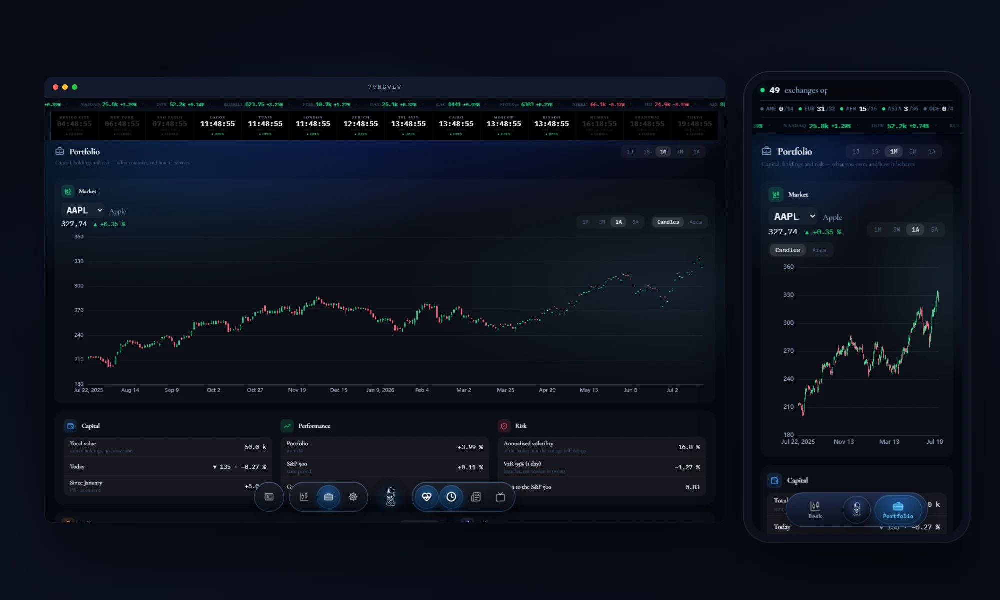
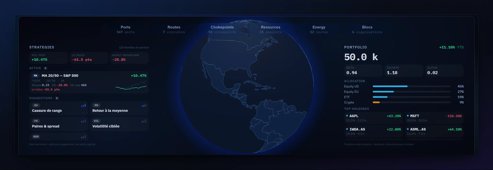
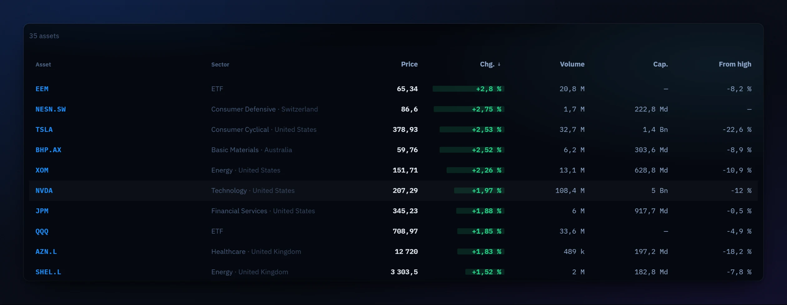
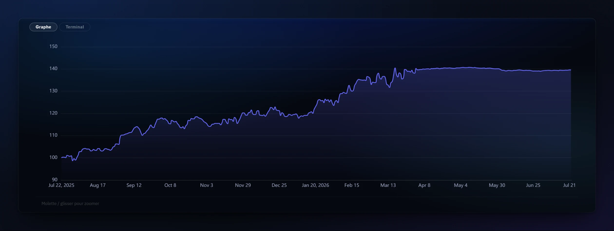
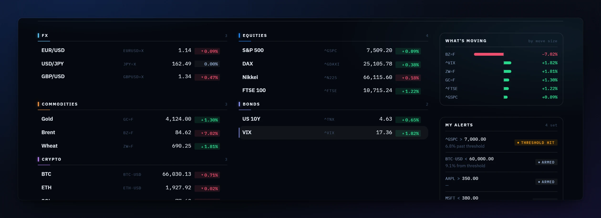
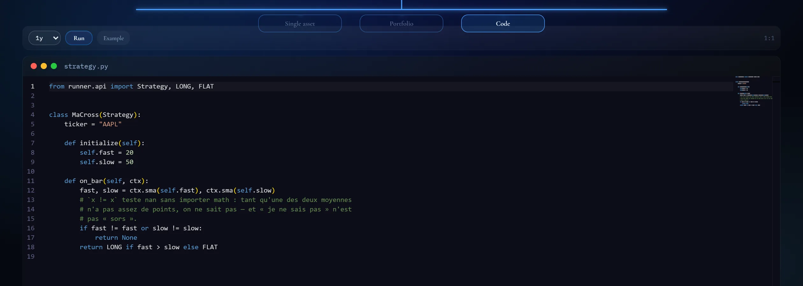
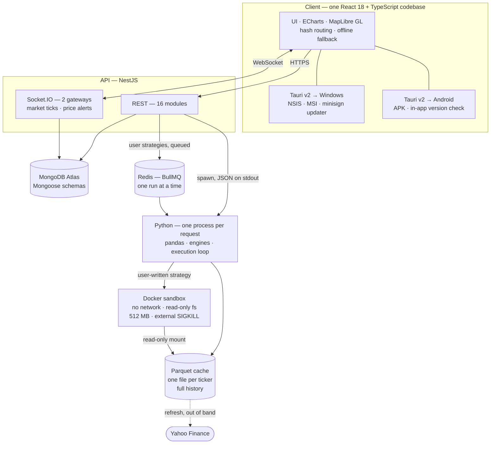

# 7vndvlv

**The goal: one workspace for the entire investing loop.**

From global markets and live news channels to a broker-connected portfolio, price alerts and a bench to backtest and compare systematic strategies.

In development · **v0.1.0** · Windows · Android · Source private

[**Features**](#features) · [**Demo**](#demo) · [**Architecture**](#architecture) · [**Decisions**](#decisions) · [**Roadmap**](#roadmap)

*The global overview on Windows, the portfolio on the phone — both in the offline
demonstration mode. The interface ships in French. The screenshots come from the
current build; the installer published under Releases is v0.1.0.*

> Built solo alongside a master's in finance, aiming for quantitative finance — the
> whole stack, from the React client to the Python quant engine and the container it
> runs strategies in, since June 2026.

---

## Features

What the app does today, on both targets:

|  |  |
|---|---|
| **Global market overview** | World map of exchanges, live indices by region, geopolitical risk band, continental panels, clocks |
| **Screener** | A fixed watchlist — 35 tickers across stocks, ETFs and crypto — sortable by change, market cap and distance from high, filterable by class. It reads a hard-coded list, not a universe scan; widening it is on the [roadmap](#roadmap) |
| **Live news streams** | Ten broadcast channels, up to six on screen at once, as rolling live streams |
| **News feed** | Headlines from four wire sources under the panels |
| **Portfolio tracking** | Allocation by asset class, risk metrics (beta, Sharpe, alpha), P&L, capital-gains tax estimate |
| **Charting** | Base-100 performance with RSI, MACD and volume overlays |
| **Price alerts** | Per-instrument thresholds, pushed over a Socket.IO gateway |
| **Strategy bench** | Three engines behind one screen: a moving-average crossover on a single asset, a cross-sectional dual-momentum portfolio, and **Python you write yourself** — see below |

**Write a strategy, get the same report as the built-in engines.** A user-written
Python class produces the eighteen statistics, the equity curve, the drawdown and the
trade log — the same report the built-in engines produce, because it is the same code
path underneath.

*Where it runs, and where it does not:* `POST /api/algo/code` streams the source to the
sandbox launcher over stdin and returns the report. The hosted API does this for real —
about nine seconds end to end, most of it container start-up and the pandas import.
Getting there meant moving the backend out of its own container and onto the host under
systemd: a process inside a container that wants to start containers has to reach the
host daemon *and* align every bind-mount path across two filesystems, since the daemon
resolves paths on the host and not in the caller. Removing a layer was cheaper than
managing one.

The public demo has no backend at all, so there the **Run** button returns a frozen
result from a real run and says so on screen, in an amber banner rather than in
silence.

The contract is deliberately poor: `on_bar(ctx)` returns a *state* — `LONG`, `FLAT`
or `None` — never an order. The fill price is decided by the execution loop at the
next open, which the strategy never sees, so look-ahead is impossible by construction
rather than by discipline. The history handed to a strategy is a read-only view
truncated at the current bar; asking for tomorrow returns nothing, and writing to it
raises.

The poverty of that contract buys something measurable: a user-written strategy and a
built-in engine run through the *same* execution loop, so their figures are
comparable by construction. The worked example — a moving-average crossover written
against the public API — reproduces `engine.py AAPL 20 50 1y` on all four keys, and
does so across two architectures: Windows arm64 outside a container, Linux amd64
inside one. Had the two disagreed, the harness would have been changing the
simulation, and there would be nothing to publish.

**Running someone else's code safely.** The strategy executes in a throwaway Docker
container: no network interface at all, a read-only filesystem, 512 MB with swap
disabled, 64 processes, every Linux capability dropped, a non-root uid, and a hard
time limit delivered as a `SIGKILL` from *outside* the Python process — a timeout the
watched code can catch is not a timeout. Six attacks were run against it and are
listed under [Decisions](#decisions).

The same React client ships to both targets. The first four screens below each have a
phone layout of their own; the strategy bench and Open positions do not — they keep
their desktop grid at 390 px, which is listed under [Roadmap](#roadmap).

### The screens

**Global overview** — exchanges on a world map, live indices by region, and the
strategy and portfolio rails either side of the globe.

**Screener** — a fixed watchlist of 35 tickers — stocks, ETFs and crypto —
sortable by change, market cap and distance from high.

**Portfolio** — base-100 performance over a year, with the manager's book
underneath: weights, value and running P&L, line by line.

**Markets & alerts** — FX, equities, commodities, bonds and crypto by asset
class, beside the price alerts armed over the Socket.IO gateway.

**Strategy bench** — the third tab is an editor. The class shown is the worked
example, and it is the one that pins the engine down: its result matches the
built-in moving-average engine to the cent.

---

## Demo

The quickest way to judge any of it is to run it — and it runs with no backend at all.

On launch the app probes for its API; if nothing answers, it drops into a built-in
demonstration mode: frozen market data and a fictional portfolio. Nothing is
persisted, and a banner says so. The screenshots above were taken in that mode.

The packaged builds do point at a live API — a small VM reachable over HTTPS — so a
fresh install talks to the real thing when it is up, and degrades to frozen data when
it is not.

Builds are published under [Releases](../../releases/latest):

| Platform | File | First run |
|---|---|---|
| **Windows** — Intel / AMD | `x64` installer | SmartScreen → **More info** → **Run anyway** |
| **Windows** — ARM (Snapdragon, Surface Pro X) | `arm64` installer | same |
| **Android** | `.apk` | allow the source once, then install |

**What the shell dictates.** A packaged app is not a browser tab, and most of the
work went into the difference:

| | |
|---|---|
| Routing | through `#/` — a file loaded off disk has no server to rewrite URLs |
| Fonts | self-hosted, carried in the bundle — no network call |
| Native CSP | a host missing from `connect-src` is blocked **silently** in the package, never in dev |
| Session | cookie **and** Bearer token — the Tauri webview has no usable cookie jar |
| No backend | the app probes its API on launch; with no answer it drops to frozen data |
| Updates | minisign-signed manifest on Windows; on Android, an in-app version check |

---

## Architecture

One React client, two packaged targets, one API, a Python process that is born and
dies with each request — and, for code the app did not write, a container that is
born and dies with it.

```mermaid
flowchart TB
    subgraph client["Client — one React 18 + TypeScript codebase"]
        ui["UI · ECharts · MapLibre GL<br/>hash routing · offline fallback"]
        win["Tauri v2 → Windows<br/>NSIS · MSI · minisign updater"]
        droid["Tauri v2 → Android<br/>APK · in-app version check"]
        ui --- win
        ui --- droid
    end

    subgraph api["API — NestJS"]
        rest["REST — 16 modules"]
        ws["Socket.IO — 2 gateways<br/>market ticks · price alerts"]
    end

    db[("MongoDB Atlas<br/>Mongoose schemas")]
    py["Python — one process per request<br/>pandas · engines · execution loop"]
    cache[("Parquet cache<br/>one file per ticker<br/>full history")]
    box["Docker sandbox<br/>no network · read-only fs<br/>512 MB · external SIGKILL"]
    q[("Redis — BullMQ<br/>one run at a time")]
    yf(["Yahoo Finance"])

    ui -->|HTTPS| rest
    ui <-->|WebSocket| ws
    rest --> db
    ws --> db
    rest -->|spawn, JSON on stdout| py
    rest -->|user strategies, queued| q
    q --> py
    py --> cache
    cache -.->|refresh, out of band| yf
    py -->|user-written strategy| box
    box -->|read-only mount| cache
```

**The API.** Sixteen REST modules — `health`, `auth`, `market`, `portfolio`,
`cashflow`, `price-alerts`, `strategies`, `algo`, `news`, `newsletters`, `ai`,
`search`, `translate`, `changelog`, `countries`, `orders` — plus two Socket.IO
gateways, one pushing market ticks and one pushing alert notifications. Auth is JWT
with bcrypt and TOTP multi-factor; the guard is still client-side, which is the
honest limit listed under [Roadmap](#roadmap).

**The Python bridge.** NestJS keeps no long-running Python process. Each request that
needs market data or a backtest spawns a script, reads JSON off its stdout and parses
it; the process then exits. No queue, no broker, no shared state. The cost is roughly
200–400 ms of interpreter startup per request; the benefit is that a script that hangs
or crashes can never poison the API — and pandas never shares a heap with Node.

**The client.** One codebase, two shells. The same React build is wrapped by Tauri v2
for Windows and for Android, so a layout fix lands on both at once — and so does a
regression. What differs is deliberately small: the desktop carries a signed updater
the Android build cannot compile, and the phone swaps the MapLibre globe for a flat
map. Everything else, including the offline fallback, is shared code.

**Data on disk.** MongoDB Atlas holds users, portfolios, cash flows, strategies and
alert thresholds. Quotes stay ephemeral — fetched per request, held in memory for 30
seconds to 10 minutes depending on how fast the figure moves, then dropped.

Historical bars are the exception, and the reason is not speed. Yahoo re-adjusts past
prices **retroactively** every time a dividend is paid, so the same backtest run three
months apart returns different numbers, with nothing to indicate why. The engines
therefore read a Parquet cache — one file per ticker, full history, refreshed out of
band — and a backtest becomes reproducible against itself. Speed came along for the
ride: a single-asset run went from 3.3 s to 0.7 s, a broad universe from 21 s to 4 s.
It is also what lets a sandboxed strategy run with no network at all.

**The stack.**

| Layer | Technology |
|---|---|
| Shell | Tauri v2 (Rust) — Windows (NSIS/MSI) and Android (APK); minisign-signed desktop updater |
| Frontend | React 18 + TypeScript, Vite, ECharts, MapLibre GL |
| Real-time | Socket.IO — two gateways |
| Backend | NestJS — 16 REST modules |
| Auth | JWT, bcrypt, TOTP multi-factor (otplib, qrcode) |
| Database | MongoDB Atlas, Mongoose schemas |
| Quant / data | Python — pandas, numpy, pyarrow; Parquet cache; three backtest engines sharing one execution loop |
| Sandbox | Docker — user strategies run with no network, a read-only filesystem, capped memory and an external `SIGKILL` |
| Queue | BullMQ on Redis, concurrency 1 — the API degrades to direct execution when Redis is absent |
| Packaging | The API runs under systemd on its host — it has to *start* containers, so it is not in one. Docker is reserved for the sandbox image |

---

## Decisions

Each part was a choice. The ones that shaped the system — and the bugs that forced
some of them:

| Decision | Why | Alternative rejected | Trade-off accepted |
|---|---|---|---|
| **Tauri v2** for the shell | Installers under 4 MB and a minisign-signed update manifest, against roughly 150 MB for a Chromium-based shell | Electron | A Rust toolchain in the build chain, and one build per target architecture |
| **One-shot Python processes** | Each request spawns a script and reads JSON off its stdout; pandas and yfinance never share state with the Node process | A long-lived Python service | 200–400 ms of interpreter startup on every request |
| **Session in a cookie *and* a Bearer token** | The Tauri webview has no usable cookie jar — the cookie is dropped silently, with no error to catch | Cookie only | Two session paths to keep in sync, and a token reachable from JavaScript |
| **Hash routing and self-hosted fonts** | The bundled app must render with no network at all | Browser routing + Google Fonts | A `#` in every URL, and font files carried in the bundle |
| **No 3D globe on the phone** | MapLibre at 390 px drains the battery, and its gestures fight the scroll; mobile gets a flat, tappable map of the exchanges | One shared map component | Two map components to maintain instead of one |
| **`native-tls` over `rustls`** | `rustls` pulls in `ring`, which needs a clang toolchain on Windows; SChannel already ships with the OS | `rustls` | TLS behaviour follows the host OS store instead of being identical everywhere |
| **Updater excluded from the Android build** | `native-tls` uses the Windows cert store but drags in OpenSSL, which won't cross-compile for Android | A single cross-platform updater | Android checks GitHub Releases in-app instead of updating silently |
| **Offline mode by intercepting one fetch chokepoint** | Every HTTP call already funnelled through a single function, so offline support cost one modified function instead of 26 mocked components | Per-component mocks | Frozen fixtures age with every market day, and WebSocket traffic bypasses the chokepoint |
| **A throwaway container per strategy run** | Running someone's Python needs an OS-level boundary. A sandbox written in Python, inside the process it is meant to watch, has never held — the watched code can always reach the watcher | An interpreter subset, or a whitelist of allowed calls | An image to build per architecture, and roughly 4 s of container start-up on every run |
| **Strategies return a state, never an order** | `on_bar` yields `LONG`/`FLAT`/`None`, and the execution loop decides the fill at the next open. The strategy never sees the price it gets, so look-ahead is structurally impossible instead of merely discouraged | An order-based API, as most backtest libraries offer | No intrabar logic, no limit orders, no position sizing from inside the strategy |
| **Historical bars cached as Parquet, one file per ticker** | Yahoo re-adjusts past prices retroactively on every dividend; without a frozen copy the same backtest does not reproduce itself | Fetching per request, as the quotes still do | The cache has to be refreshed out of band, and a delisted ticker never enters it — survivorship bias is not solved, only made visible |
| **Strategy runs are queued, one at a time** | A run holds 512 MB for nine seconds on a 956 MB host. Two at once was measured: **17.4 s each**, against **7.1 s and 5.7 s** when serialised. Processes fighting for memory lose more than they would have lost waiting | Running them concurrently and hoping | A second user waits for the first, and a parameter sweep is serial |

**The sandbox, tested rather than asserted.** Six attacks, run on an amd64 VM:

| Attack | Result |
|---|---|
| `urllib.request.urlopen("http://example.com")` | fails at name resolution — there is no interface |
| write to `/app`, `/data`, `/etc`, and to the runner's own source | all refused; only a `noexec` tmpfs accepts a byte |
| `while True: pass` wrapped in `except BaseException` | killed at the limit — a `SIGKILL` from another process cannot be caught |
| allocate until death | killed at 512 MB after 9.3 s |
| fork bomb | stopped after 61 forks |
| `os.listdir("/")`, `/etc/shadow`, `/root`, the Docker socket | a bare container root; the rest is `PermissionError`; no socket |

Three problems that took real debugging:

- **MongoDB Atlas unreachable on a local network** — the LAN's DNS server couldn't
  resolve `mongodb+srv` (`querySrv ECONNREFUSED`); fixed with a `DNS_SERVERS`
  override applied before bootstrap.
- **Memory exhaustion on a 512 MB host** — overlapping pandas polls stacked until
  the container hit its ceiling and restarted; fixed with a re-entrancy guard, a
  slower interval and a kill switch.
- **A shipped app that displayed nothing** — the bundled backend URL pointed at the
  visitor's own `localhost`, leaving them stuck at a login gate; fixed with a
  startup probe that drops into offline mode.

---

## Roadmap

In active development.

**Known limits**

- One strategy at a time, on purpose — see the queue under [Decisions](#decisions). A parameter sweep therefore runs serially, so a grid of twenty settings costs about three minutes rather than twenty seconds
- A run costs about nine seconds, nearly all of it container start-up. Fine for writing a strategy; the cost is paid per run and nothing amortises it yet
- The cache has to be refreshed by hand; a ticker missing from it fails the run rather than falling back to the network, which is deliberate but unattended
- The API runs on a single small VM behind an HTTPS tunnel — no redundancy, no uptime guarantee; when it stops answering, clients fall back to frozen data
- The screener reads a hard-coded list of 35 tickers; there is no universe scan behind it
- Quotes carry yfinance's lag; the real-time Socket.IO gateway only feeds price alerts
- No broker is connected — the **Paper** pill sends no orders; positions are held in the database
- Authorisation is client-side only — JWT + TOTP exist, but no server-side guard enforces them yet
- Two screens have no phone layout — **Open positions** and **Strategies** keep their two-column
  grid at 390 px, so the allocation donut covers the metric cards and the strategy list is crushed
- The AI assistant is built but unrouted
- Strategies are single-asset: `on_bar` returns one state for one ticker, so a user-written
  portfolio is not expressible yet

**Planned**

- [ ] Persist a written strategy, not just a browser-local draft
- [ ] Parameter sweeps — the queue makes them possible, the interface does not offer them yet
- [ ] Target weights instead of a single state, for multi-asset strategies
- [ ] A real screener universe instead of a fixed watchlist
- [ ] Phone layouts for the two remaining screens
- [ ] Thematic sector watch — the dial is in place, the feeds are not wired
- [ ] Server-side authorisation
- [ ] Broker integration for live orders

---

**The source code is private.** This repository hosts the installers, the update
manifest and this write-up.
