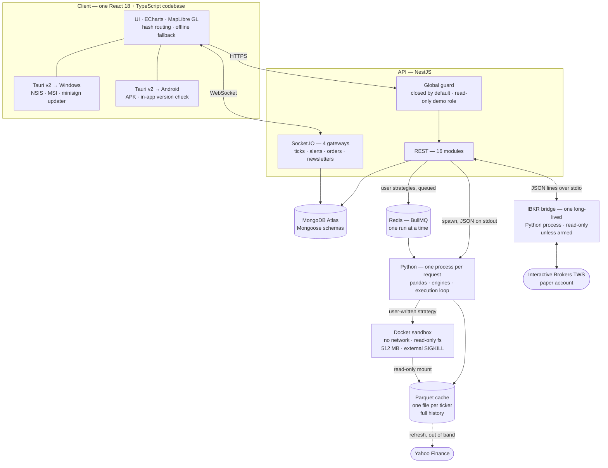

# Architecture — 7vndvlv

Full detail behind the [README](../README.md): the request path, the decisions
that shaped it, and the failures that forced some of them.

---

## The screens

**Global overview** — exchanges on a world map, live indices by region, strategy
and portfolio rails either side of the globe.

**Portfolio** — base-100 performance over a year, with the manager's book
underneath: weights, value and running P&L, line by line.

**Markets & alerts** — FX, equities, commodities, bonds and crypto by asset
class, beside the price alerts armed over Socket.IO.

**Strategy bench** — the third tab is an editor. The class shown is the worked
example, and it is the one that pins the engine down: its result matches the
built-in moving-average engine to the cent.

---

## Request path

One React client, two packaged targets, one API, a Python process that is born and
dies with each request — and two exceptions: a container that is born and dies with
code the app did not write, and one Python process that stays up, because a broker
answers when it wants to.

**The API.** Sixteen REST modules — `health`, `auth`, `market`, `portfolio`,
`cashflow`, `price-alerts`, `strategies`, `algo`, `news`, `newsletters`, `ai`,
`search`, `translate`, `changelog`, `countries`, `orders` — plus four Socket.IO
gateways: market ticks for everyone, and alert notifications, order status and
newsletter counts to each user's own room. Auth is JWT with bcrypt and TOTP
multi-factor.

**Authorisation is closed by default.** A global guard refuses every route that is
not explicitly marked public — only what must work before signing in, such as the
health probe and the login itself — and that includes the routes written tomorrow.
The token proves who you are, but not whether your account still exists or what it
may do today: the session is re-read from the database, behind a 30-second cache, so
a deleted account loses access at once instead of keeping it until its token expires.
Two more guards run after it — the read-only demo account, then roles.

**The Python bridge.** For market data and backtests, NestJS keeps no long-running
Python process. Each request spawns a script, reads JSON off its stdout and parses it;
the process then exits, and nothing is shared between two runs. The cost is roughly
200–400 ms of interpreter startup per request; the benefit is that a script that hangs
or crashes can never poison the API — and pandas never shares a heap with Node.

**The broker bridge — the one exception.** An order sent at 10:02 can be filled at
10:47, and a script that has already exited cannot hear it. The Interactive Brokers
bridge is therefore the only permanent Python process in the system: JSON lines over
stdin and stdout, supervised by NestJS, restarted after a crash with a back-off that
grows from 2 seconds to 60. It is off unless switched on. And it never retries a
refusal: pointed at a live port or at a non-paper account, it stops for good until
someone changes the configuration — waiting two seconds would only produce the same
no, forever.

**The client.** One codebase, two shells. The same React build is wrapped by Tauri v2
for Windows and for Android, so a layout fix lands on both at once — and so does a
regression. What differs is deliberate: the desktop carries a signed updater the
Android build cannot compile, and the phone gets its own navigation — a companion
rather than a workstation. Everything else, including the offline fallback, is
shared code.

**Data on disk.** MongoDB Atlas holds users, portfolios, cash flows, strategies,
orders, mandates and alert thresholds. Quotes stay ephemeral — fetched per request,
held in memory for 30 seconds to 10 minutes depending on how fast the figure moves,
then dropped.

Historical bars are the exception, and the reason is not speed. Yahoo re-adjusts past
prices **retroactively** every time a dividend is paid, so the same backtest run three
months apart returns different numbers, with nothing to indicate why. The engines
therefore read a Parquet cache — one file per ticker, full history, refreshed out of
band — and a backtest becomes reproducible against itself. Speed came along for the
ride: a single-asset run went from 3.3 s to 0.7 s, a broad universe from 21 s to 4 s.
It is also what lets a sandboxed strategy run with no network at all.

### Sandboxing user code

The strategy executes in a throwaway Docker container: no network interface at all, a
read-only filesystem, 512 MB with swap disabled, 64 processes, every Linux capability
dropped, a non-root uid, and a hard time limit delivered as a `SIGKILL` from *outside*
the Python process — a timeout the watched code can catch is not a timeout.

Tested rather than asserted. Six attacks, run on an amd64 VM:

| Attack | Result |
|---|---|
| `urllib.request.urlopen("http://example.com")` | fails at name resolution — there is no interface |
| write to `/app`, `/data`, `/etc`, and to the runner's own source | all refused; only a `noexec` tmpfs accepts a byte |
| `while True: pass` wrapped in `except BaseException` | killed at the limit — a `SIGKILL` from another process cannot be caught |
| allocate until death | killed at 512 MB after 9.3 s |
| fork bomb | stopped after 61 forks |
| `os.listdir("/")`, `/etc/shadow`, `/root`, the Docker socket | a bare container root; the rest is `PermissionError`; no socket |

### The contract

`on_bar(ctx)` returns a *state* — `LONG`, `FLAT` or `None` — never an order,
deliberately poor. The fill price is decided by the execution loop at the next
open, which the strategy never sees, so look-ahead is impossible by construction
rather than by discipline. The history handed to a strategy is a read-only view
truncated at the current bar; asking for tomorrow returns nothing, and writing to
it raises.

A user-written strategy and a built-in engine run through the *same* execution
loop, so their figures are comparable by construction. The worked example — a
moving-average crossover written against the public API — reproduces
`engine.py AAPL 20 50 1y` on all four keys, across two architectures: Windows
arm64 outside a container, Linux amd64 inside one.

**Saving a strategy runs it again.** The save goes through the same queue as a
run, and what is stored is the server's result — never the figures on screen. A
strategy that crashes is refused, and nothing is written. The save also sends the
code that *ran*, not the code in the editor: a warning appears when the two have
drifted apart.

---

## The stack

| Layer | Technology |
|---|---|
| Shell | Tauri v2 (Rust) — Windows (NSIS/MSI) and Android (APK); minisign-signed desktop updater |
| Frontend | React 18 + TypeScript, Vite, ECharts, MapLibre GL |
| Real-time | Socket.IO — four gateways |
| Backend | NestJS — 16 REST modules |
| Auth | JWT, bcrypt, TOTP multi-factor (otplib, qrcode); a global guard, closed by default, with a read-only demo role and roles |
| Database | MongoDB Atlas, Mongoose schemas |
| Quant / data | Python — pandas, numpy, pyarrow; Parquet cache; three backtest engines sharing one execution loop |
| Sandbox | Docker — user strategies run with no network, a read-only filesystem, capped memory and an external `SIGKILL` |
| Queue | BullMQ on Redis, concurrency 1 — the API degrades to direct execution when Redis is absent |
| Broker | Interactive Brokers through TWS (ib_insync), behind a venue interface; a local simulator by default |
| Packaging | The API runs under systemd on its host — it has to *start* containers, so it is not in one. Docker is reserved for the sandbox image |

---

## Decisions

Each part was a choice. The ones that shaped the system — and the bugs that forced
some of them:

| Decision | Why | Alternative rejected | Trade-off accepted |
|---|---|---|---|
| **Tauri v2** for the shell | Installers around 5 MB and a minisign-signed update manifest, against roughly 150 MB for a Chromium-based shell | Electron | A Rust toolchain in the build chain, and one build per target architecture |
| **One-shot Python processes** | Each request spawns a script and reads JSON off its stdout; pandas and yfinance never share state with the Node process | A long-lived Python service | 200–400 ms of interpreter startup on every request |
| **Session in a cookie *and* a Bearer token** | The Tauri webview has no usable cookie jar — the cookie is dropped silently, with no error to catch | Cookie only | Two session paths to keep in sync, and a token reachable from JavaScript |
| **Authorisation closed by default** | The previous default — open unless a controller remembered to check — had left most modules reachable without a session, and nobody had decided that | A check written in each controller | Every public route has to be marked; a forgotten mark shows up as a 401 rather than as a leak |
| **Hash routing and self-hosted fonts** | The bundled app must render with no network at all | Browser routing + Google Fonts | A `#` in every URL, and font files carried in the bundle |
| **The phone is a companion, not a small desktop** | On a phone you watch, get alerted and check; you do not write strategies. Its bar carries the desk and the portfolio, and the globe stays on the desktop | The same screens, squeezed to 390 px | Some screens are reachable only from a desktop |
| **`native-tls` over `rustls`** | `rustls` pulls in `ring`, which needs a clang toolchain on Windows; SChannel already ships with the OS | `rustls` | TLS behaviour follows the host OS store instead of being identical everywhere |
| **Updater excluded from the Android build** | `native-tls` uses the Windows cert store but drags in OpenSSL, which won't cross-compile for Android | A single cross-platform updater | Android checks GitHub Releases in-app instead of updating silently |
| **Offline mode by intercepting one fetch chokepoint** | Every HTTP call already funnelled through a single function, so offline support cost one modified function instead of 26 mocked components | Per-component mocks | Frozen fixtures age with every market day, and WebSocket traffic bypasses the chokepoint |
| **A throwaway container per strategy run** | Running someone's Python needs an OS-level boundary. A sandbox written in Python, inside the process it is meant to watch, has never held — the watched code can always reach the watcher | An interpreter subset, or a whitelist of allowed calls | An image to build per architecture, and roughly 4 s of container start-up on every run |
| **Strategies return a state, never an order** | `on_bar` yields `LONG`/`FLAT`/`None`, and the execution loop decides the fill at the next open. The strategy never sees the price it gets, so look-ahead is structurally impossible instead of merely discouraged | An order-based API, as most backtest libraries offer | No intrabar logic, no limit orders, no position sizing from inside the strategy |
| **Historical bars cached as Parquet, one file per ticker** | Yahoo re-adjusts past prices retroactively on every dividend; without a frozen copy the same backtest does not reproduce itself | Fetching per request, as the quotes still do | The cache has to be refreshed out of band, and a delisted ticker never enters it — survivorship bias is not solved, only made visible |
| **Strategy runs are queued, one at a time** | A run holds 512 MB for nine seconds on a 956 MB host. Two at once was measured: **17.4 s each**, against **7.1 s and 5.7 s** when serialised. Processes fighting for memory lose more than they would have lost waiting | Running them concurrently and hoping | A second user waits for the first, and a parameter sweep is serial |
| **Saved figures come from the server** | Saving a strategy re-runs its code through the queue; the stored result is the server's, so a figure on screen can never be passed off as a measurement | Storing the client's last run | A save costs a full run, about nine seconds |
| **Orders go through a venue interface, simulated by default** | The whole chain — ticket, feed, order lifecycle, socket — was written and shown before a broker was connected. The simulator acknowledges asynchronously and leaves an unreachable limit working, because an instant "filled" is an interface no real broker could honour | Calling the broker straight from the service | The simulator invents no slippage, fees or order book — its fills are not measurements, and it says so |
| **Three separate switches before an order reaches IBKR** | Start the bridge, allow it to transmit (otherwise TWS itself holds the session read-only), make it the venue — and, above all three, a refusal of any non-paper account. "Is TWS answering?", "may it transmit?" and "should my orders really go?" are three different questions | A single on/off flag | Four environment variables to get right before anything moves |

---

## Debugging notes

- **MongoDB Atlas unreachable on a local network** — the LAN's DNS server couldn't
  resolve `mongodb+srv` (`querySrv ECONNREFUSED`); fixed with a `DNS_SERVERS`
  override applied before bootstrap.
- **Memory exhaustion on a 512 MB host** — overlapping pandas polls stacked until
  the container hit its ceiling and restarted; fixed with a re-entrancy guard, a
  slower interval and a kill switch.
- **A shipped app that displayed nothing** — the bundled backend URL pointed at the
  visitor's own `localhost`, leaving them stuck at a login gate; fixed with a
  startup probe that drops into offline mode.

---

## Roadmap

In active development.

**Known limits**

- One strategy at a time, on purpose — see the queue under [Decisions](#decisions). A parameter sweep therefore runs serially, so a grid of twenty settings costs about three minutes rather than twenty seconds
- A run costs about nine seconds, nearly all of it container start-up. Fine for writing a strategy; the cost is paid per run and nothing amortises it yet
- The cache has to be refreshed by hand; a ticker missing from it fails the run rather than falling back to the network, which is deliberate but unattended
- The API runs on a single small VM behind an HTTPS tunnel — no redundancy, no uptime guarantee; when it stops answering, clients fall back to frozen data
- Quotes carry yfinance's delay; nothing in the stack is a real-time exchange feed
- Orders fill on the local simulator. The route to IBKR is written end to end, but so far the bridge has only read the paper account's balances
- The order book still assumes USD while the paper account's base currency is CHF — amounts are never converted, so they sit side by side instead of being added up
- Script files in the terminal live in the browser's storage until they are saved as a strategy
- The strategies page keeps its desktop grid on a phone
- The chat assistant is built, but nothing in the interface calls it
- Strategies are single-asset: `on_bar` returns one state for one ticker, so a user-written
  portfolio is not expressible yet

**Planned**

- [ ] Parameter sweeps — the queue makes them possible, the interface does not offer them yet
- [ ] Target weights instead of a single state, for multi-asset strategies
- [ ] Orders transmitted to IBKR — the paper account first, a live account after
- [ ] Alerts and the morning digest delivered while the app is closed
- [ ] Thematic sector watch — the dial is in place, the feeds are not wired
